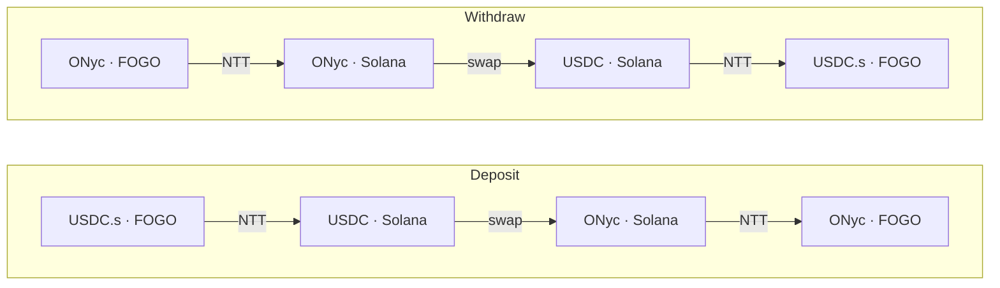

# Fogo OnRe

A cross-chain yield bridge. Users deposit **USDC.s on FOGO** and receive
**ONyc on FOGO** — a token that earns yield from
[OnRe](https://github.com/onre-finance/onre-sol)'s tokenized reinsurance
product on Solana. To withdraw, users send ONyc back and receive USDC.s.

Both bridge legs run over
[Wormhole NTT](https://wormhole.com/products/native-token-transfers)
(USDC.s ↔ USDC and ONyc ↔ ONyc). On Solana, a small **relayer** program
holds capital only in-flight and CPIs into OnRe to swap between USDC and
ONyc. Users sign **one** transaction on FOGO; everything after is
permissionless cranking.

## How it works



Each leg is the same three-step pipeline on Solana, driven by three
permissionless relayer instructions:

| Step       | Instruction | Deposit                     | Withdraw                     |
| ---------- | ----------- | --------------------------- | ---------------------------- |
| 1. Receive | `receive`   | claim inbound USDC from NTT | claim inbound ONyc from NTT  |
| 2. Swap    | `swap`      | USDC → ONyc on OnRe         | ONyc → USDC on OnRe          |
| 3. Send    | `send`      | NTT-send ONyc back to FOGO  | NTT-send USDC.s back to FOGO |

`receive` opens a one-shot `Flow` receipt that records the direction and
recipient; `swap` and `send` read it, so no caller can redirect funds.
Yield accrues automatically — ONyc is a claim on a position whose
on-chain price advances as OnRe's reinsurance book earns.

## Trust model in one paragraph

The relayer is the user's trust boundary. Its program ID is canonical and
its CPI destinations (NTT managers, OnRe) are pinned in `constants.rs`.
Outbound recipients are read from the unforgeable NTT
`ValidatedTransceiverMessage`, so a stolen _operator_ key cannot redirect
funds. The _config authority_ can adjust fees (capped at **10% per leg**,
with a ~2-day timelock on increases), rotate the fee vault, set swap
slippage, and repoint the price oracle (a DoS at worst — swaps fail
closed). The _upgrade authority_ can ship new bytecode and bypass every
check, so it must be a multisig or finalized to `None` at deploy. Full
detail in [`docs/architecture.md`](./docs/architecture.md).

## Repo layout

```
programs/relayer/          Anchor program (Rust) — the Solana relayer.
programs/intent-transfer/  First-party fork of FOGO's intent_transfer
                           (deposit/redeem entry); excluded from the workspace.
packages/sdk/              TypeScript SDK (@fogo-onre/sdk): client + builders.
packages/cli/              Operator CLI (@fogo-onre/cli): configure + ops.
packages/cranker/          Off-chain VAA executor that drives the legs.
packages/webapp/           Next.js front-end.
tests/                     LiteSVM end-to-end tests.
```

## Quick start

```bash
pnpm install

# Build the relayer + SDK
anchor build
pnpm sdk build

# Tests (pretest rebuilds the SDK and the .so)
anchor test          # Rust unit + LiteSVM e2e
pnpm test            # vitest

# Lint
cargo clippy --workspace
pnpm lint
```

Toolchain is pinned: Rust 1.95.0, Anchor 1.0.2, Solana CLI 3.1.8,
pnpm 11.1.0, Node 24.

## Documentation

| File                                             | Read for                                                  |
| ------------------------------------------------ | --------------------------------------------------------- |
| [`docs/architecture.md`](./docs/architecture.md) | System design, flow lifecycle, state, instructions, trust |

## Program ID

`onrenRKgX54qtWeK3cuaTBE71xx7dWMXn82ubH61vAp` — defined for localnet,
devnet, and mainnet in [`Anchor.toml`](./Anchor.toml) and
`programs/relayer/src/lib.rs`. Confirm the deploy status on-chain before
assuming any cluster is live.
