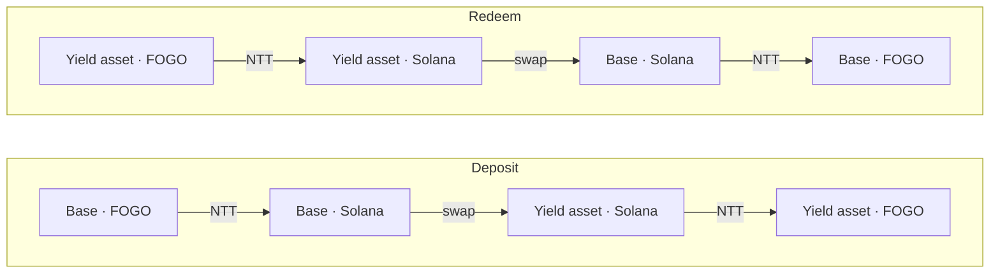

# Fogo Yield

[](https://fogo.io)
[](https://www.npmjs.com/package/@ignitionfi/fogo-onre)
[](https://github.com/pointgroup-labs/fogo-onre/actions/workflows/ci.yml)

A **universal cross-chain yield layer** for FOGO. Deposit a base asset and
receive a **yield-bearing token** bridged from Solana — it keeps earning its
native yield while you hold it on FOGO, and you can redeem back to the base
asset at any time. You sign **one** transaction on FOGO; everything after is
permissionless cranking.

The protocol is **asset-agnostic**: the on-chain relayer and the SDK work for
any `(base, yield-asset)` pair, onboarded with a single `initialize` call. The
first live deployment bridges **USDC ↔ ONyc**, where
[OnRe](https://github.com/onre-finance/onre-sol)'s tokenized reinsurance on
Solana is the yield source.

## How it works



Both legs run over [Wormhole NTT](https://wormhole.com/products/native-token-transfers).
On Solana, a small **relayer** program holds funds only while a flow is open,
swaps through the configured venue, then sends the output back to FOGO. Each leg
is the same three-step pipeline, driven by three permissionless relayer
instructions:

| Step       | Instruction | Deposit                           | Redeem                             |
| ---------- | ----------- | --------------------------------- | ---------------------------------- |
| 1. Receive | `receive`   | claim inbound base from NTT       | claim inbound yield asset from NTT |
| 2. Swap    | `swap`      | base → yield asset                | yield asset → base                 |
| 3. Send    | `send`      | NTT-send yield asset back to FOGO | NTT-send base back to FOGO         |

`receive` opens a one-shot `Flow` receipt. `swap` enforces the user's signed
minimum output, and `send` returns the result to the recorded recipient. Yield
accrues automatically — the asset is a claim on a position whose on-chain price
advances as its underlying strategy earns (for USDC ↔ ONyc, OnRe's reinsurance
book).

## Trust model

The relayer is the user's trust boundary. For each token pair, it pins the
token mints, NTT managers, and allowed FOGO origin programs at initialization.
Flow instructions are permissionless: a cranker can execute them, but cannot
change the recipient or lower the user's signed `min_swap_out`. If no swap ever
clears that floor, anyone can `refund` the inbound token back to FOGO after a
timeout, so funds are never stranded.

The config authority can rotate the fee vault and adjust fees, capped at
**10% per leg** with a ~2-day timelock on increases. The upgrade authority can
ship new bytecode and bypass every check, so it must be a multisig or finalized
to `None` at deploy. Full detail in [`docs/architecture.md`](./docs/architecture.md).

## Program IDs

First-party programs. Third-party CPI targets, NTT managers, and token mints
are listed in [`docs/architecture.md`](./docs/architecture.md). Confirm deploy
status on-chain before assuming any cluster is live.

| Program                  | Chain  | ID                                            |
| ------------------------ | ------ | --------------------------------------------- |
| Relayer                  | Solana | `onrenRKgX54qtWeK3cuaTBE71xx7dWMXn82ubH61vAp` |
| `intent_transfer` (fork) | FOGO   | `inTFf5S7ZtYr8SkwGG85mjDwAyJwjqEPdH2p2nuyrL9` |

## Components

| Path                        | Description                                                                                |
| --------------------------- | ------------------------------------------------------------------------------------------ |
| `programs/relayer/`         | Anchor program (Rust) — the asset-agnostic Solana relayer.                                 |
| `programs/intent-transfer/` | First-party fork of FOGO's intent_transfer entry, with reviewed edits; workspace-excluded. |
| `packages/sdk/`             | TypeScript SDK (`@fogo-yield/sdk`): client + builders.                                     |
| `packages/cli/`             | Operator CLI (`@fogo-yield/cli`): configure + ops.                                         |
| `packages/cranker/`         | Off-chain VAA executor that drives the legs.                                               |
| `tests/`                    | LiteSVM end-to-end tests.                                                                  |

## Quick start

```bash
pnpm install

# Build the relayer .so (vanity program ID → --ignore-keys) + SDK
anchor build --ignore-keys
pnpm sdk build

# Test
cargo test -p fogo-ntt-relayer --lib   # Rust unit tests
pnpm test                              # LiteSVM e2e (pretest rebuilds .so + SDK)
```

Toolchain is pinned: Rust 1.96.0 (edition 2024), Anchor 1.1.2, Solana CLI
3.1.8, pnpm 11.1.0, Node 24.

## First deployment: USDC ↔ ONyc

The reference deployment configures the pair as USDC (base) and ONyc (yield
asset). ONyc is OnRe's reinsurance yield token; its on-chain price advances as
the book earns, so holders accrue yield without any action. Mints, NTT
managers, and the active swap venue are listed under **Current Deployment** in
[`docs/architecture.md`](./docs/architecture.md). Additional pairs are onboarded
by running `initialize` for a new `(base_mint, asset_mint)` — no new code.

## Development

```bash
cargo fmt --all              # format Rust
cargo clippy --workspace     # lint Rust
pnpm lint                    # lint TypeScript / Markdown
pnpm lint:fix                # auto-fix
```

## Documentation

[`docs/architecture.md`](./docs/architecture.md) — system design, the flow
lifecycle, on-chain state, the instruction surface, and the trust model.

## License

[Apache License 2.0](./LICENSE).
