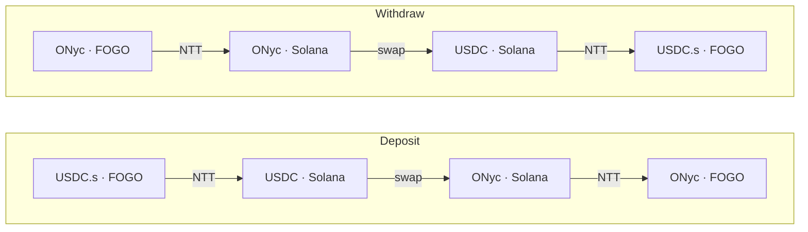

# Fogo OnRe

[](https://fogo.io)
[](https://www.npmjs.com/package/@ignitionfi/fogo-onre)
[](https://github.com/pointgroup-labs/fogo-onre/actions/workflows/ci.yml)

A cross-chain yield bridge. Deposit **USDC.s on FOGO** and receive **ONyc**
— a token that earns yield from
[OnRe](https://github.com/onre-finance/onre-sol)'s tokenized reinsurance on
Solana. Withdraw by sending ONyc back for USDC.s. You sign **one**
transaction on FOGO; everything after is permissionless cranking.

## How it works



Both legs run over [Wormhole NTT](https://wormhole.com/products/native-token-transfers)
(USDC.s ↔ USDC and ONyc ↔ ONyc). On Solana, a small **relayer** program holds
capital only in-flight and CPIs into OnRe to swap. Each leg is the same
three-step pipeline, driven by three permissionless relayer instructions:

| Step       | Instruction | Deposit                     | Withdraw                     |
| ---------- | ----------- | --------------------------- | ---------------------------- |
| 1. Receive | `receive`   | claim inbound USDC from NTT | claim inbound ONyc from NTT  |
| 2. Swap    | `swap`      | USDC → ONyc on OnRe         | ONyc → USDC on OnRe          |
| 3. Send    | `send`      | NTT-send ONyc back to FOGO  | NTT-send USDC.s back to FOGO |

`receive` opens a one-shot `Flow` receipt that records the direction and
recipient; `swap` and `send` read it, so no caller can redirect funds. Yield
accrues automatically — ONyc is a claim on a position whose on-chain price
advances as OnRe's reinsurance book earns.

## Trust model

The relayer is the user's trust boundary. Its program ID is canonical and its
CPI destinations (NTT managers, OnRe) are pinned in `constants.rs`. Outbound
recipients are read from the unforgeable NTT `ValidatedTransceiverMessage`, so
a stolen _operator_ key cannot redirect funds. The _config authority_ can
adjust fees (capped at **10% per leg**, with a ~2-day timelock on increases),
rotate the fee vault, set swap slippage, and repoint the price oracle (a DoS
at worst — swaps fail closed). The _upgrade authority_ can ship new bytecode
and bypass every check, so it must be a multisig or finalized to `None` at
deploy. Full detail in [`docs/architecture.md`](./docs/architecture.md).

## Program IDs

First-party programs. Third-party CPI targets (OnRe, NTT managers) and token
mints are listed in [`docs/architecture.md`](./docs/architecture.md). The
relayer ID is the declared ID across clusters — confirm the deploy status
on-chain before assuming any cluster is live.

| Program                  | Chain  | ID                                            |
| ------------------------ | ------ | --------------------------------------------- |
| Relayer                  | Solana | `onrenRKgX54qtWeK3cuaTBE71xx7dWMXn82ubH61vAp` |
| `intent_transfer` (fork) | FOGO   | `inTFf5S7ZtYr8SkwGG85mjDwAyJwjqEPdH2p2nuyrL9` |

## Components

| Path                        | Description                                                                                |
| --------------------------- | ------------------------------------------------------------------------------------------ |
| `programs/relayer/`         | Anchor program (Rust) — the Solana relayer.                                                |
| `programs/intent-transfer/` | First-party fork of FOGO's intent_transfer entry, with reviewed edits; workspace-excluded. |
| `packages/sdk/`             | TypeScript SDK (`@fogo-onre/sdk`): client + builders.                                      |
| `packages/cli/`             | Operator CLI (`@fogo-onre/cli`): configure + ops.                                          |
| `packages/cranker/`         | Off-chain VAA executor that drives the legs.                                               |
| `packages/webapp/`          | Next.js front-end.                                                                         |
| `tests/`                    | LiteSVM end-to-end tests.                                                                  |

## Quick start

```bash
pnpm install

# Build the relayer .so + SDK
anchor build
pnpm sdk build

# Test
anchor test          # Rust unit + LiteSVM e2e
pnpm test            # vitest — pretest rebuilds the .so + SDK
```

Toolchain is pinned: Rust 1.95.0, Anchor 1.0.2, Solana CLI 3.1.8,
pnpm 11.1.0, Node 24.

## Development

```bash
cargo fmt --all              # format Rust
cargo clippy --workspace     # lint Rust
pnpm lint                    # lint TypeScript / Markdown
pnpm lint:fix                # auto-fix
```

## Documentation

[`docs/architecture.md`](./docs/architecture.md) — system design, the flow
lifecycle, on-chain state, the instruction surface, and the trust model.

## License

[Apache License 2.0](./LICENSE).
