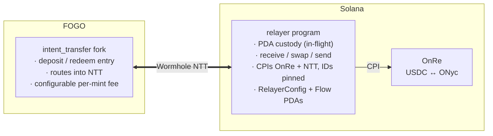
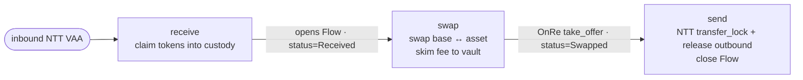

# Architecture

Fogo OnRe bridges yield between two chains: users hold **USDC.s on FOGO**,
the protocol parks capital in **OnRe's ONyc on Solana**, and a stateless
Solana **relayer** shuttles value between them over Wormhole NTT. This
document covers the moving parts, the per-flow lifecycle, on-chain state,
the instruction surface, and the trust model.

> **Token naming.** `USDC.s` is FOGO's wrapped USDC; plain `USDC` is the
> canonical Solana mint. They are distinct tokens linked by an NTT manager.
> `ONyc` is OnRe's yield token, bridged the same way. The `.s` suffix is
> only used here and in on-chain metadata matchers — user-facing copy says
> "USDC".

## Two-chain design

A user signs exactly one transaction on FOGO (deposit or redeem, via the
intent-transfer fork). That NTT-sends tokens to Solana, where the relayer's
three permissionless instructions complete the round trip and NTT-send the
result back to FOGO. An off-chain **cranker** submits those permissionless
steps, but anyone can — the relayer enforces correctness on-chain.

## Components

| Component              | Chain  | Role                                                                                                                                                                   |
| ---------------------- | ------ | ---------------------------------------------------------------------------------------------------------------------------------------------------------------------- |
| `intent_transfer` fork | FOGO   | First-party fork of FOGO's deposit/redeem entry; routes `bridge_ntt_tokens` into NTT, with a configurable per-mint `fee_recipient`. Workspace-excluded, own toolchain. |
| Relayer program        | Solana | Anchor program. Holds USDC/ONyc only in PDA-owned ATAs while in-flight. CPIs into NTT + OnRe. Persistent state is small (`RelayerConfig` + per-flow `Flow`).           |
| Wormhole NTT managers  | both   | Native Token Transfers for USDC.s↔USDC and ONyc↔ONyc. Same program IDs on both chains.                                                                                 |
| OnRe                   | Solana | Tokenized reinsurance. The relayer swaps USDC↔ONyc against an OnRe `Offer`.                                                                                            |
| `@fogo-onre/sdk`       | —      | Typed `RelayerClient`, PDA derivation, NTT/OnRe account-list builders.                                                                                                 |
| `@fogo-onre/cli`       | —      | Operator CLI: relayer `configure`, PDA inspection, deploy/ops.                                                                                                         |
| Cranker                | —      | Off-chain executor: polls Wormholescan for signed VAAs and submits the inbound legs. Central to the withdraw flow.                                                     |
| Webapp                 | —      | Next.js front-end wired to the live NTT managers.                                                                                                                      |

## Flow lifecycle

Every deposit and withdraw is the same three on-chain steps on Solana. The
direction (`Deposit` or `Withdraw`) is decided at `receive` and persisted
in the `Flow` receipt; `swap` and `send` route off it — there is no
direction argument to forge.

| Phase     | Deposit                                | Withdraw                              |
| --------- | -------------------------------------- | ------------------------------------- |
| `receive` | claim USDC from the USDC NTT manager   | claim ONyc from the ONyc NTT manager  |
| `swap`    | USDC → ONyc, fee skimmed from ONyc out | ONyc → USDC, fee skimmed from ONyc in |
| `send`    | NTT-lock ONyc → ONyc minted on FOGO    | NTT-lock USDC → USDC.s minted on FOGO |

- **Deposit** flows live under the inbound PDA namespace, **withdraw** under
  the outbound one (`Flow::seed`), so the two directions never collide on a
  shared NTT inbox item.
- Replay protection is the per-VAA NTT claim account, not the `Flow` — the
  `Flow` is a one-shot receipt that `send` closes (reclaiming rent).
- `swap` is value-floored: the relayer computes an expected output from the
  config-pinned OnRe `Offer` (the price oracle) and rejects a swap that
  comes in under `max_slippage_bps`.

## On-chain state

### `RelayerConfig` (singleton PDA)

| Field                                  | Purpose                                                                |
| -------------------------------------- | ---------------------------------------------------------------------- |
| `base_mint` / `asset_mint`             | USDC and ONyc on Solana.                                               |
| `authority`                            | Governance key. Gates `configure` + `accept_authority` only.           |
| `fee_vault`                            | ONyc token account that receives skimmed fees.                         |
| `deposit_fee_bps` / `withdraw_fee_bps` | Per-leg fee, each ≤ `MAX_FEE_BPS` (1000 = 10%).                        |
| `max_slippage_bps`                     | NAV slippage tolerance for both swap legs, ≤ `MAX_SLIPPAGE_BPS` (200). |
| `price_oracle`                         | Pinned OnRe `Offer` PDA — the swap value floor. Zero ⇒ fail-closed.    |
| `pending_authority`                    | Step-2 target of a two-step authority rotation.                        |
| `pending_fee`                          | Staged fee _increase_, auto-promoted once its timelock elapses.        |
| `reserved [u8; 96]`                    | Headroom for future fixed-size fields — no realloc, no migration.      |

The layout keeps all fixed-size fields ahead of the two trailing
`Option`s, so additive fields are carved from `reserved` and old zero
bytes read as the new field's default.

### `Flow` (per-transfer PDA)

| Field       | Purpose                                                           |
| ----------- | ----------------------------------------------------------------- |
| `recipient` | FOGO originator; the outbound recipient on the return leg.        |
| `direction` | `Deposit` or `Withdraw`. Set at `receive`, read by `swap`/`send`. |
| `status`    | `Received` → `Swapped`. Guards step ordering.                     |
| `amount`    | Recorded inbound amount.                                          |
| `payer`     | Rent payer (refunded when `send` closes the flow).                |

## Instruction surface

| Instruction        | Access         | Effect                                                                      |
| ------------------ | -------------- | --------------------------------------------------------------------------- |
| `initialize`       | deployer       | Create the config PDA and relayer-authority-owned ATAs.                     |
| `receive`          | permissionless | Redeem an inbound NTT VAA, sweep tokens into custody, open the `Flow`.      |
| `swap`             | permissionless | Route-agnostic OnRe swap; skim the fee; mark `Swapped`.                     |
| `send`             | permissionless | NTT `transfer_lock` + atomic `release_wormhole_outbound`; close the `Flow`. |
| `configure`        | authority      | Set fees / slippage / price oracle / pending authority. `None` = unchanged. |
| `accept_authority` | pending auth   | Step 2 of rotation; the new key claims, no co-sign from the old key.        |

The flow instructions take account lists in `remaining_accounts` assembled
by the SDK builders; `send` carries a `transfer_lock_account_count` that
splits the list between the two NTT CPIs.

## Trust & security model

| Key                | Can do                                                                                                                         | Cannot do                                                                                               |
| ------------------ | ------------------------------------------------------------------------------------------------------------------------------ | ------------------------------------------------------------------------------------------------------- |
| Operator / cranker | Submit `receive` / `swap` / `send` for any flow.                                                                               | Redirect funds — recipients come from the unforgeable NTT `ValidatedTransceiverMessage`.                |
| Config authority   | Rotate `fee_vault`; raise fees (≤ 10%, ~2-day timelock); lower fees instantly; set `max_slippage_bps`; repoint `price_oracle`. | Move in-flight custody; exceed the caps; redirect a flow. A bad oracle is DoS only — swaps fail closed. |
| Upgrade authority  | Replace the program bytecode (and thereby bypass every check above).                                                           | Nothing is enforced against it — it **must** be a multisig or finalized to `None`.                      |

Fee changes are asymmetric: a **decrease** applies immediately, an
**increase** stages in `pending_fee` and only promotes after
`FEE_TIMELOCK_SLOTS` (~2 days at 400ms slots); a later raise can extend but
never shorten an in-flight window. Authority rotation is two-step
(`configure` sets `pending_authority`, `accept_authority` claims), so two
independent multisigs can hand over without an atomic co-sign.

> **Upgradeability note.** The relayer is upgradeable by default
> (BPFLoaderUpgradeable). Calling it "immutable" only becomes true once the
> upgrade authority is set `--final` at deploy. Until then, treat the
> upgrade key as the real root of trust.

## Program IDs & constants

| Name               | Value                                          |
| ------------------ | ---------------------------------------------- |
| Relayer            | `onrenRKgX54qtWeK3cuaTBE71xx7dWMXn82ubH61vAp`  |
| OnRe               | `onreuGhHHgVzMWSkj2oQDLDtvvGvoepBPkqyaubFcwe`  |
| NTT manager (USDC) | `nttu74CdAmsErx5daJVCQNoDZujswFrskMzonoZSdGk`  |
| NTT manager (ONyc) | `nttpna5vXW7BN2Aa4AfTbkCncJWTEoBsnWvjS87Xgsd`  |
| USDC mint (Solana) | `EPjFWdd5AufqSSqeM2qN1xzybapC8G4wEGGkZwyTDt1v` |
| ONyc mint (Solana) | `5Y8NV33Vv7WbnLfq3zBcKSdYPrk7g2KoiQoe7M2tcxp5` |
| ONyc mint (FOGO)   | `oNyCm1QsAatj3ckaEwZjtAPWvstPn3Zm5MAYPtkjEfa`  |

| Constant              | Value     | Meaning                               |
| --------------------- | --------- | ------------------------------------- |
| `MAX_FEE_BPS`         | `1000`    | Per-leg fee ceiling (10%).            |
| `MAX_SLIPPAGE_BPS`    | `200`     | Swap NAV slippage ceiling (2%).       |
| `FEE_TIMELOCK_SLOTS`  | `432_000` | Fee-increase delay (~2 days @ 400ms). |
| FOGO Wormhole chain   | `51`      | Outbound NTT recipient chain.         |
| Solana Wormhole chain | `1`       | Inbound NTT source chain.             |

Program IDs and seeds are the single source of truth in
`programs/relayer/src/constants.rs` (mirrored in `packages/sdk/src/constants.ts`).
NTT/OnRe instruction ABIs are hand-mirrored and guarded by sha256 fixture
pins — when a pin fires, refresh the binary and the mirrored types together.
