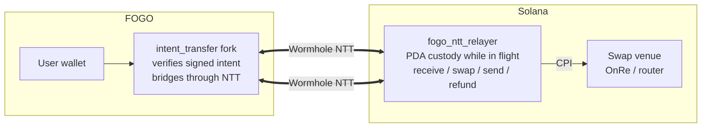
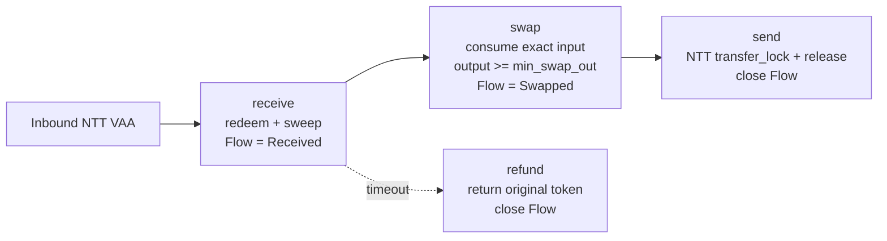

# Architecture

Fogo Yield is a universal cross-chain yield layer: a two-chain bridge around a
small Solana relayer program. A user submits one signed transaction on FOGO.
Wormhole NTT carries the base token to Solana, the relayer swaps it into a
yield-bearing asset, then NTT carries the result back to FOGO. Redeeming runs
the same pipeline in reverse.

The on-chain relayer is asset-agnostic: it is configured per
`base_mint` / `asset_mint` pair, so any base / yield-asset pair can be onboarded
with a single `initialize` call. The first live deployment configures that pair
as USDC / ONyc, where [OnRe](https://github.com/onre-finance/onre-sol)'s
tokenized reinsurance on Solana is the yield source. This document describes the
relayer architecture, then calls out the live deployment values where useful.

## System Shape



The cranker is only an executor. It watches for VAAs and submits relayer
instructions, but every safety property is enforced on-chain. Any account can
crank the flow.

## Components

| Component              | Role                                                                                                                        |
| ---------------------- | --------------------------------------------------------------------------------------------------------------------------- |
| `intent_transfer` fork | FOGO entrypoint. Verifies the user's Ed25519 intent and sends the token through NTT to a signed recipient address.          |
| `fogo_ntt_relayer`     | Solana Anchor program. Holds funds only in relayer-PDA ATAs while a flow is open.                                           |
| Wormhole NTT managers  | One manager per token side. Program IDs are pinned in `PairConfig` at initialization.                                       |
| Swap venue             | Caller-supplied CPI target. The relayer does not price the route; it only enforces the user's floor and custody invariants. |
| SDK / CLI              | Derive PDAs, build NTT and swap account lists, initialize/configure pairs.                                                  |
| Cranker                | Off-chain service that polls Wormholescan and advances pending flows.                                                       |

## One Flow

Every deposit or withdraw has the same Solana lifecycle. `receive` creates a
`Flow`; `swap`, `send`, and `refund` read that `Flow` and never trust a caller
supplied direction.



| Phase     | Deposit                                           | Withdraw                                           |
| --------- | ------------------------------------------------- | -------------------------------------------------- |
| `receive` | Bring in the base token.                          | Bring in the asset token.                          |
| `swap`    | Base → asset; fee is taken from asset output.     | Asset → base; fee is taken from asset input.       |
| `send`    | Send asset back to FOGO.                          | Send base back to FOGO.                            |
| `refund`  | Return the original base token if no swap clears. | Return the original asset token if no swap clears. |

`refund` is deliberately narrow: it only works on stale `Received` flows,
never swaps, returns funds to `flow.recipient`, and closes the flow.

## User-Signed Floor

The core protection is `min_swap_out`.

1. The UI computes a minimum acceptable output.
2. The FOGO signed intent sends the inbound NTT transfer to a recipient PDA:
   `[b"user_inbox", user_wallet, min_swap_out_le]`.
3. The same transaction includes a short memo carrying `min_swap_out` so the
   cranker can recover the value.
4. On Solana, `receive` re-derives the PDA from `(user_wallet, min_swap_out)`
   and requires it to match the NTT inbox recipient.
5. `swap` later enforces `out_received >= flow.min_swap_out`.

A cranker cannot lower the floor: a different `min_swap_out` derives a
different inbox PDA and `receive` fails. A bad route cannot settle below the
floor: `swap` fails and the flow can later be refunded.

There is no protocol-wide oracle band or governance-controlled slippage value
in the relayer.

## On-Chain State

### `PairConfig`

One config account exists per token pair.

PDA:

```text
[PairConfig::SEED, base_mint, asset_mint]
```

Important fields:

| Field                                   | Meaning                                                                                               |
| --------------------------------------- | ----------------------------------------------------------------------------------------------------- |
| `base_mint`, `asset_mint`               | Pair identity. Init-only.                                                                             |
| `ntt_base_program`, `ntt_asset_program` | NTT managers for each token side. Init-only.                                                          |
| `intent_programs`                       | Two allowed source programs. `receive` derives each setter PDA and matches the VAA sender. Init-only. |
| `authority`                             | Governance signer for `configure`. Does not gate user flows.                                          |
| `fee_vault`                             | Asset-token account receiving protocol fees.                                                          |
| `deposit_fee_bps`, `withdraw_fee_bps`   | Per-leg fees, capped by `MAX_FEE_BPS`.                                                                |
| `pending_fee`                           | Timelocked fee increases. Fee decreases apply immediately.                                            |
| `pending_authority`                     | Two-step authority handoff target.                                                                    |
| `reserved`                              | Fixed-size headroom for future fields.                                                                |

The fixed-size fields stay before the trailing `Option`s to keep layout changes
predictable.

### `Flow`

One flow account exists per inbound NTT message and pair.

PDA:

```text
[Flow::seed(direction), pair_config, ntt_inbox_item]
```

Important fields:

| Field           | Meaning                                                     |
| --------------- | ----------------------------------------------------------- |
| `recipient`     | FOGO wallet that receives the final NTT transfer or refund. |
| `direction`     | `Deposit` or `Withdraw`; set once by `receive`.             |
| `status`        | `Received` or `Swapped`; enforces step order.               |
| `amount`        | Current flow amount. Updated after `swap`.                  |
| `min_swap_out`  | User-signed output floor.                                   |
| `received_slot` | Timeout anchor for `refund`.                                |
| `payer`         | Rent recipient when the flow closes.                        |

The NTT inbox item provides replay protection. The `Flow` is a receipt and
state-machine guard; terminal paths close it.

## Instructions

| Instruction        | Access            | Purpose                                                                             |
| ------------------ | ----------------- | ----------------------------------------------------------------------------------- |
| `initialize`       | signer            | Create a `PairConfig`, relayer-owned ATAs, and init-only pins.                      |
| `receive`          | permissionless    | Redeem/release inbound NTT, bind `min_swap_out`, sweep into custody, open `Flow`.   |
| `swap`             | permissionless    | CPI into a route, enforce exact input consumption and output floor, mark `Swapped`. |
| `send`             | permissionless    | NTT-send swapped output back to FOGO and close `Flow`.                              |
| `refund`           | permissionless    | After timeout, NTT-send the original token back and close `Flow`.                   |
| `configure`        | authority         | Change mutable governance fields: fees, fee vault, pending authority.               |
| `accept_authority` | pending authority | Complete a two-step authority rotation.                                             |

`receive`, `send`, and `refund` use NTT account lists supplied through
`remaining_accounts`. `send` and `refund` split that list between
`transfer_lock` and `release_wormhole_outbound`. `swap` receives opaque
`swap_ix_data` and route accounts for the selected venue. Governance
instructions are pair-scoped by the same base/asset config PDA seeds.

## Security Model

| Actor              | Can do                                                               | Cannot do                                                                                               |
| ------------------ | -------------------------------------------------------------------- | ------------------------------------------------------------------------------------------------------- |
| Cranker / operator | Submit permissionless flow instructions; choose swap route data.     | Redirect funds, lower the signed floor, settle below the floor, or leave standing token authority.      |
| Config authority   | Change fees within caps, rotate fee vault, stage authority rotation. | Change mints, NTT managers, or intent programs after init; touch in-flight custody; bypass user floors. |
| Upgrade authority  | Replace program code.                                                | Nothing on-chain constrains it; it is the root of trust until removed.                                  |

`swap` is safe to keep route-agnostic because it uses delta accounting:

- input balance must decrease by exactly the expected amount;
- output balance must increase by at least `min_swap_out`;
- relayer ATAs must still be owned by the relayer PDA;
- no delegate, delegated amount, or close authority may remain.

Fee increases are staged for `FEE_TIMELOCK_SLOTS`; decreases apply immediately.
Authority rotation is two-step so the new authority must explicitly accept.

## Current Deployment

The live product pair is USDC / ONyc.

| Name                    | Value                                          |
| ----------------------- | ---------------------------------------------- |
| Relayer program         | `onrenRKgX54qtWeK3cuaTBE71xx7dWMXn82ubH61vAp`  |
| Base mint, Solana USDC  | `EPjFWdd5AufqSSqeM2qN1xzybapC8G4wEGGkZwyTDt1v` |
| Asset mint, Solana ONyc | `5Y8NV33Vv7WbnLfq3zBcKSdYPrk7g2KoiQoe7M2tcxp5` |
| FOGO ONyc mint          | `oNyCm1QsAatj3ckaEwZjtAPWvstPn3Zm5MAYPtkjEfa`  |
| USDC NTT manager        | `nttu74CdAmsErx5daJVCQNoDZujswFrskMzonoZSdGk`  |
| ONyc NTT manager        | `nttpna5vXW7BN2Aa4AfTbkCncJWTEoBsnWvjS87Xgsd`  |
| Current deposit venue   | OnRe `take_offer`                              |

## Constants

| Constant               | Value     | Meaning                                                 |
| ---------------------- | --------- | ------------------------------------------------------- |
| `MAX_FEE_BPS`          | `1000`    | Maximum per-leg fee: 10%.                               |
| `FEE_TIMELOCK_SLOTS`   | `432_000` | Fee increase delay, about 2 days at 400ms slots.        |
| `REFUND_TIMEOUT_SLOTS` | `54_000`  | Refund eligibility delay, about 6 hours at 400ms slots. |
| FOGO Wormhole chain    | `51`      | Inbound source and outbound recipient chain.            |

Seed constants live with the account implementations (`PairConfig::SEED`,
`Flow::INBOUND_SEED`, `Flow::OUTBOUND_SEED`) and are mirrored by the SDK PDA
helpers. NTT instruction ABIs are mirrored in code; when upstream NTT changes,
refresh the mirrored types and fixture pins together.

## Operational Notes

- Adding a pair means running `initialize` for a new `(base_mint, asset_mint)`.
- Existing singleton-config deployments require a planned migration or a fresh
  deployment; `PairConfig` and `Flow` seeds are pair-bound.
- Open flows are one-shot. Let them finish through `send` or `refund` before
  changing deployment assumptions.
- The upgrade authority is the real root of trust until the program is
  finalized.
