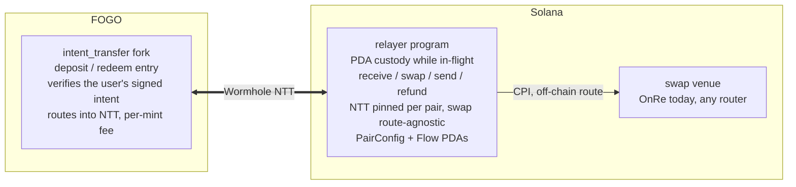
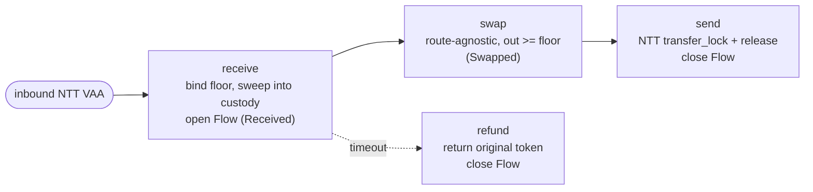

# Architecture

Fogo OnRe bridges yield between two chains: users hold **USDC.s on FOGO**,
the protocol's capital earns in **OnRe's ONyc on Solana**, and a stateless
Solana **relayer** shuttles value between them over Wormhole NTT. The relayer
itself is token-pair-agnostic; USDC/ONyc is simply the pair it is configured
for. This document covers the moving parts, the per-flow lifecycle, on-chain
state, the instruction surface, and the trust model.

> **Token naming.** `USDC.s` is FOGO's wrapped USDC; plain `USDC` is the
> canonical Solana mint. They are distinct tokens linked by an NTT manager.
> `ONyc` is OnRe's yield token, bridged the same way. The `.s` suffix appears
> only here and in on-chain metadata matchers; user-facing copy says "USDC".

## Two-chain design

A user signs exactly one transaction on FOGO (deposit or redeem, via the
intent-transfer fork). That signature commits a **minimum output** and
NTT-sends tokens to Solana, where the relayer's permissionless instructions
complete the round trip and NTT-send the result back to FOGO. An off-chain
**cranker** submits those steps, but anyone can: the relayer enforces
correctness on-chain, and the user's signed floor bounds the swap no matter
who runs it.

## Components

| Component              | Chain  | Role                                                                                                                                                                                                          |
| ---------------------- | ------ | ----------------------------------------------------------------------------------------------------------------------------------------------------------------------------------------------------------- |
| `intent_transfer` fork | FOGO   | First-party fork of FOGO's deposit/redeem entry. Verifies the user's Ed25519 intent (via the Instructions sysvar), then routes `bridge_ntt_tokens` into NTT with the signed recipient and a per-mint `fee_recipient`. Workspace-excluded, own toolchain. |
| Relayer program        | Solana | Anchor program (`fogo_ntt_relayer`). Holds tokens only in PDA-owned ATAs while in-flight. NTT managers are init-pinned per pair; the swap route is supplied per call. State is small: one `PairConfig` per pair plus a per-transfer `Flow`. |
| Wormhole NTT managers  | both   | Native Token Transfers for USDC.s↔USDC and ONyc↔ONyc. Pinned into `PairConfig` at init.                                                                                                                       |
| Swap venue             | Solana | Whatever program the cranker routes the swap through (OnRe's `take_offer` today). The relayer is agnostic; the user's `min_swap_out` floor is the protection, not a pinned venue.                              |
| `@fogo-onre/sdk`       | —      | Typed `RelayerClient`, PDA derivation, NTT/swap account-list builders.                                                                                                                                        |
| `@fogo-onre/cli`       | —      | Operator CLI: `initialize` / `configure`, PDA inspection, deploy/ops.                                                                                                                                         |
| Cranker                | —      | Off-chain executor: polls Wormholescan for signed VAAs and submits the inbound legs.                                                                                                                          |
| Webapp                 | —      | Next.js front-end wired to the live NTT managers.                                                                                                                                                             |

## Flow lifecycle

Every deposit and withdraw is the same sequence of permissionless steps on
Solana. The direction (`Deposit` or `Withdraw`) is decided at `receive` and
persisted in the `Flow` receipt; `swap`, `send`, and `refund` route off it,
so there is no direction argument to forge.

| Phase     | Deposit                              | Withdraw                            |
| --------- | ------------------------------------ | ----------------------------------- |
| `receive` | claim USDC from the USDC NTT manager | claim ONyc from the ONyc NTT manager |
| `swap`    | USDC → ONyc, fee from ONyc output    | ONyc → USDC, fee from ONyc input    |
| `send`    | NTT-lock ONyc → ONyc minted on FOGO  | NTT-lock USDC → USDC.s minted on FOGO |

- **Deposit** flows live under the inbound PDA namespace (`Flow::INBOUND_SEED`),
  **withdraw** under the outbound one (`OUTBOUND_SEED`), so the two directions
  never collide on a shared NTT inbox item.
- Replay protection is the per-VAA NTT claim account, not the `Flow`; the
  `Flow` is a one-shot receipt that `send` (or `refund`) closes, reclaiming rent.
- `swap` is **value-floored by the user**: it enforces
  `out_received >= flow.min_swap_out`, the minimum the user signed on FOGO.
  There is no protocol oracle or slippage band; the relayer does not price the
  trade, it just refuses to settle below the signed floor.
- `refund` is the liveness escape hatch: if a `Received` flow is never swapped,
  after `REFUND_TIMEOUT_SLOTS` anyone can return the original token to the FOGO
  originator and close the flow.

## On-chain state

### `PairConfig` (one PDA per token pair)

PDA seeds `[b"relayer_config", base_mint, asset_mint]`, so each pair is
custody-isolated and adding a pair is another `initialize`, not a fork.

| Field                                  | Purpose                                                                                       |
| -------------------------------------- | -------------------------------------------------------------------------------------------- |
| `base_mint` / `asset_mint`             | The pair (USDC and ONyc for the live deployment). Init-only.                                  |
| `authority`                            | Governance key. Gates `configure` + `accept_authority` only.                                  |
| `fee_vault`                            | Asset-token account that receives skimmed fees.                                               |
| `ntt_base_program` / `ntt_asset_program` | NTT managers for each side. Init-only safety pins; every NTT CPI is checked against them.   |
| `intent_programs[2]`                   | Programs allowed to originate inbound VAAs. `receive` pins the VAA sender to each entry's setter PDA. Init-only, no primary/fallback. |
| `deposit_fee_bps` / `withdraw_fee_bps` | Per-leg fee, each ≤ `MAX_FEE_BPS` (1000 = 10%).                                               |
| `relayer_authority_bump` / `bump`      | Cached PDA bumps.                                                                             |
| `reserved [u8; 64]`                    | Headroom for future fixed-size fields — no realloc, no migration.                            |
| `pending_authority`                    | Step-2 target of a two-step authority rotation.                                              |
| `pending_fee`                          | Staged fee _increase_, auto-promoted once its timelock elapses.                              |

Fixed-size fields sit ahead of the two trailing `Option`s, so additive fields
are carved from `reserved` and old zero bytes read as the new field's default.

### `Flow` (one PDA per transfer)

PDA seeds `[Flow::seed(direction), pair_config, ntt_inbox_item]`.

| Field          | Purpose                                                              |
| -------------- | ------------------------------------------------------------------- |
| `recipient`    | FOGO originator; the outbound recipient on the return leg.           |
| `direction`    | `Deposit` or `Withdraw`. Set at `receive`, read by `swap`/`send`/`refund`. |
| `status`       | `Received` → `Swapped`. Guards step ordering.                        |
| `amount`       | Recorded inbound amount.                                             |
| `min_swap_out` | The user-signed output floor `swap` must clear.                      |
| `received_slot`| Slot at `receive`; the `refund` timeout anchor.                     |
| `payer` / `bump` | Rent payer (refunded on close) and cached bump.                   |

### The floor binding

The floor is the heart of the trust model, so it earns its own note. The
user's `min_swap_out` is never supplied by the cranker; it is committed by the
user's signature on FOGO and re-derived on Solana:

- On FOGO, the intent fork verifies the user's Ed25519 signature and emits an
  NTT transfer whose **recipient address is the PDA
  `[b"user_inbox", user_wallet, min_swap_out]`**. The floor is literally
  encoded in where the tokens are sent.
- On Solana, `receive` re-derives that PDA from the supplied
  `(user_wallet, min_swap_out)`, asserts it equals the inbox item's
  `recipient_address`, and pins the VAA's NTT sender to a configured
  `intent_programs` setter. A cranker that tries a lower floor derives a
  different PDA and fails the recipient check.

So `min_swap_out` lands in the `Flow` already bound to the signature, and
`swap` enforces it.

## Instruction surface

| Instruction        | Access         | Effect                                                                                          |
| ------------------ | -------------- | ---------------------------------------------------------------------------------------------- |
| `initialize`       | deployer       | Create a pair's config PDA + relayer-owned ATAs; pin mints, NTT managers, and intent programs. |
| `receive`          | permissionless | Redeem an inbound NTT VAA, bind the user floor, sweep tokens into custody, open the `Flow`.     |
| `swap`             | permissionless | Route-agnostic swap via a caller-supplied program; enforce `out >= floor`; skim the asset-denominated fee; mark `Swapped`. |
| `send`             | permissionless | NTT `transfer_lock` + atomic `release_wormhole_outbound`; close the `Flow`.                     |
| `refund`           | permissionless | After the timeout, return a stale `Received` flow's original token via NTT; close the `Flow`.   |
| `configure`        | authority      | Adjust fees, rotate the fee vault, and propose an authority rotation. `None` leaves a field unchanged. |
| `accept_authority` | pending auth   | Step 2 of rotation; the new key claims, no co-sign from the old key.                            |

`receive`, `swap`, `send`, and `refund` take their NTT/route account lists in
`remaining_accounts` assembled by the SDK builders; `send`/`refund` carry a
`transfer_lock_account_count` that splits the list between the two NTT CPIs,
and `swap` carries the opaque `swap_ix_data` for the routed program.
`configure`/`accept_authority` derive their config PDA from the account's own
stored mints, so they take no mint arguments.

## Trust & security model

| Key                | Can do                                                                                                            | Cannot do                                                                                                                                            |
| ------------------ | --------------------------------------------------------------------------------------------------------------- | ------------------------------------------------------------------------------------------------------------------------------------------------- |
| Operator / cranker | Submit `receive`/`swap`/`send`/`refund`; choose the swap route and `swap_ix_data`.                               | Redirect funds (recipient comes from the unforgeable VTM); settle a swap below the user's signed `min_swap_out`; substitute a different floor (the inbox-PDA recipient binding pins it). |
| Config authority   | Rotate `fee_vault`; raise fees (≤ 10%, ~2-day timelock) or lower them instantly; rotate authority (two-step).    | Touch in-flight custody; exceed the fee cap; change the pinned mints / NTT managers / intent programs (init-only); redirect a flow.                  |
| Upgrade authority  | Replace the program bytecode, bypassing every check above.                                                       | Nothing is enforced against it; it **must** be a multisig or finalized to `None`.                                                                   |

The swap is protected by the **user**, not by governance: because
`min_swap_out` is bound to the FOGO signature, a malicious or compromised
cranker can pick any route but still cannot extract more than the user agreed
to lose. That is what lets every flow instruction stay permissionless. The
mechanism behind it is delta-accounting: `swap` brackets the routed CPI with
balance snapshots (it must consume exactly the flow's input and yield at least
the floor) and asserts the relayer's ATAs come back pristine, so an arbitrary
route can neither over-spend custody nor leave a lingering delegate.

Fee changes are asymmetric: a **decrease** applies immediately; an
**increase** stages in `pending_fee` and only promotes after
`FEE_TIMELOCK_SLOTS` (~2 days at 400ms slots), and a later raise can extend
but never shorten an in-flight window. Authority rotation is two-step
(`configure` sets `pending_authority`, `accept_authority` claims), so two
independent multisigs can hand over without an atomic co-sign.

> **Upgradeability note.** The relayer is upgradeable by default
> (BPFLoaderUpgradeable). Calling it "immutable" only becomes true once the
> upgrade authority is set `--final` at deploy. Until then, treat the upgrade
> key as the real root of trust.

## Program IDs & constants

| Name                              | Value                                          |
| --------------------------------- | ---------------------------------------------- |
| Relayer                           | `onrenRKgX54qtWeK3cuaTBE71xx7dWMXn82ubH61vAp`  |
| USDC mint (Solana, `base_mint`)   | `EPjFWdd5AufqSSqeM2qN1xzybapC8G4wEGGkZwyTDt1v` |
| ONyc mint (Solana, `asset_mint`)  | `5Y8NV33Vv7WbnLfq3zBcKSdYPrk7g2KoiQoe7M2tcxp5` |
| ONyc mint (FOGO)                  | `oNyCm1QsAatj3ckaEwZjtAPWvstPn3Zm5MAYPtkjEfa`  |
| NTT manager (USDC)                | `nttu74CdAmsErx5daJVCQNoDZujswFrskMzonoZSdGk`  |
| NTT manager (ONyc)                | `nttpna5vXW7BN2Aa4AfTbkCncJWTEoBsnWvjS87Xgsd`  |
| OnRe (current swap venue)         | `onreuGhHHgVzMWSkj2oQDLDtvvGvoepBPkqyaubFcwe`  |

The mints, NTT managers, and intent programs are **per-pair config** pinned at
`initialize`, not program constants; the values above are the live USDC/ONyc
deployment. OnRe is the venue the cranker currently routes through, not a
pinned dependency.

| Constant               | Value     | Meaning                                          |
| ---------------------- | --------- | ------------------------------------------------ |
| `MAX_FEE_BPS`          | `1000`    | Per-leg fee ceiling (10%).                       |
| `FEE_TIMELOCK_SLOTS`   | `432_000` | Fee-increase delay (~2 days @ 400ms).            |
| `REFUND_TIMEOUT_SLOTS` | `54_000`  | Age before a `Received` flow can be refunded (~6 h). |
| FOGO Wormhole chain    | `51`      | Inbound VAA source and outbound recipient chain. |

Program IDs and seeds are the single source of truth in
`programs/relayer/src/constants.rs` and on the account impls (`PairConfig::SEED`,
`Flow::INBOUND_SEED`/`OUTBOUND_SEED`), mirrored in `packages/sdk/src/constants.ts`.
NTT instruction ABIs are hand-mirrored and guarded by sha256 fixture pins; when
a pin fires, refresh the binary and the mirrored types together.
